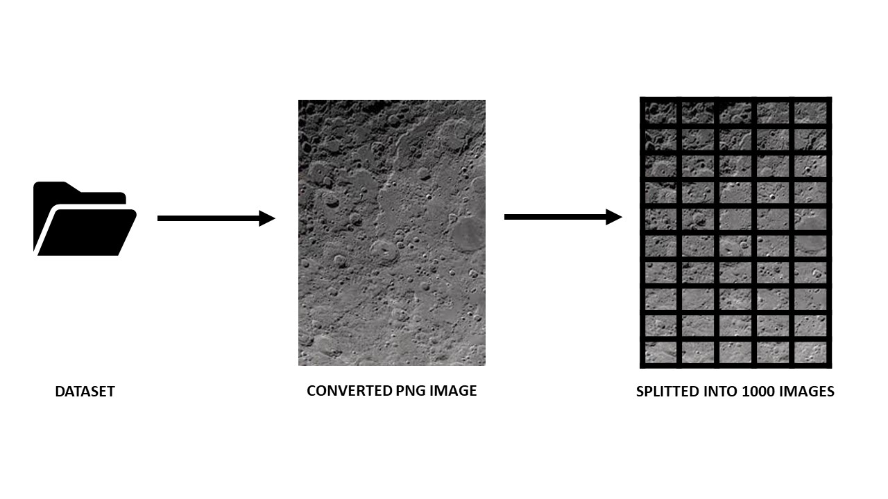
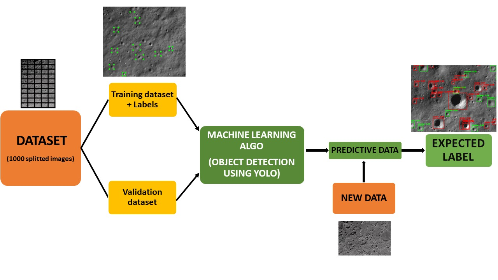
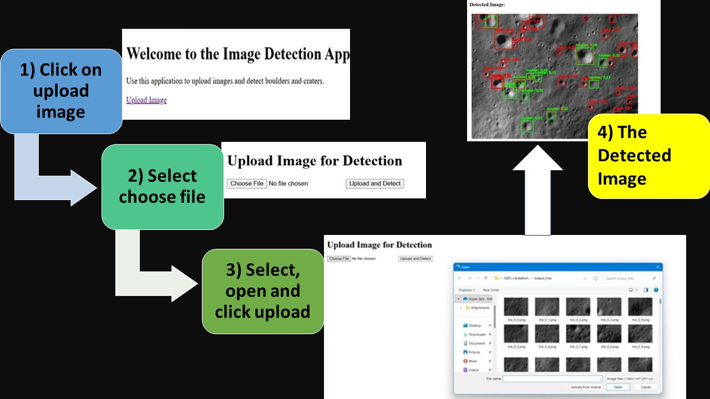

# AI/ML Model for Crater and Boulder Detection in OHRC Data

## Overview
This project develops an AI/ML model to detect craters and boulders in Optical High-Resolution Camera (OHRC) data from the ISRO Chandrayaan mission. The model can identify craters and boulders of varying shapes and sizes, providing details such as their locations (latitude/longitude) and boundaries. 
A Flask-based web application has been developed to allow users to upload OHRC images and perform real-time crater and boulder detection using the trained model.

## Dataset
The dataset used for training the detection model is publicly available from the ISRO Chandrayaan mission through the PDS4 format on the ISRO Map Browse portal. It consists of high-resolution images of the lunar surface.

## Important Folders and Files 
- **Batch_1_ISRO_Dataset_Labelled**: Contains labelled images of the moon, done using LabelImg tool.
- **Dataset2**:
  - `train`: ~300 labelled images for training.
  - `val`: ~100 labelled images for validation.
  - `moon.yaml`: Metadata file with paths for the dataset, number of classes (2: boulder and crater), and class names.
- **detections**: ~20 images showing craters and boulders detected by the trained model.
- **runs/detect**: Model performance results, including:
  - F1 Score Curve
  - Precision-Recall Curve
  - Precision Curve
  - Recall Curve
  - Confusion Matrix
- **templates**: HTML files for the web interface to upload images and detect craters and boulders.
- **App.py**: Flask application script to handle user requests and model predictions.
- **requirements.txt**: List of required libraries and dependencies.
- **Image_splitter.ipynb**: Jupyter notebook used to split large images into smaller patches for model training.

 ## Project Flow 

